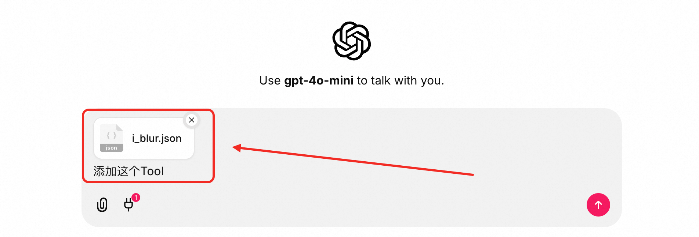
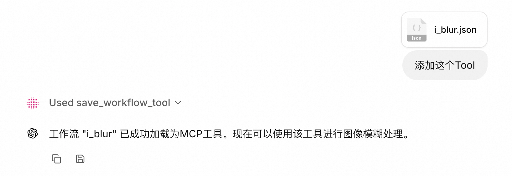
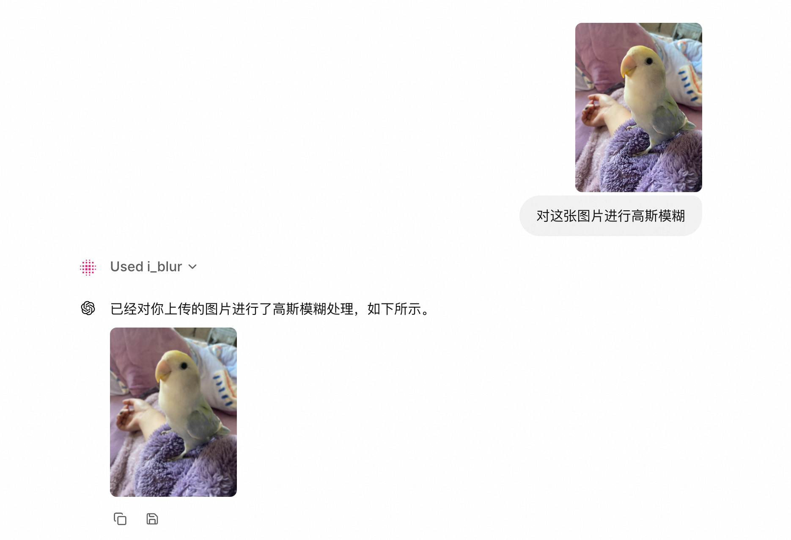

<h1 align="center">🎨 Pixelle MCP - 全模态融合智能体框架</h1>

<p align="center">✨ 基于 MCP 协议的 AIGC 方案，0代码将 ComfyUI 工作流无缝转化为 MCP Tool，让 LLM 与 ComfyUI 强强联合。</p>

<p align="center"><a href="README.md">English</a> | <b>中文</b></p>

https://github.com/user-attachments/assets/8b7e3d9e-dcf3-4ac4-be23-17d59eb3ea24

## 📁 项目结构

- **mcp-base**: 🔧 基础服务，提供文件存储和共用服务能力
- **mcp-client**: 🌐 MCP 客户端，基于 Chainlit 构建的 Web 界面
- **mcp-server**: 🗄️ MCP 服务端，提供各种 AIGC 工具和服务

## 🚀 功能特性

- [x] 🔄 **全模态支持**: 支持TISV（Text、Image、Sound/Speech、Video）全模态的互转和生成
- [x] 🧩 **ComfyUI生态**: Server端底层基于[ComfyUI](https://github.com/comfyanonymous/ComfyUI)实现，继承ComfyUI的开放生态下的所有能力
- [x] 🔧 **零代码开发**: 制定并实现了 Workflow 即 MCP Tool 的方案，0代码开发，即可动态添加新的 MCP Tool
- [x] 🗄️ **MCP Server**: Server端基于[MCP](https://modelcontextprotocol.io/introduction)协议提供功能支持，支持任意mcp client集成（包含但不限于Cursor、Claude Desktop等）
- [x] 🌐 **MCP Client**: Client端基于[Chaintlit](https://github.com/Chainlit/chainlit)框架开发，继承了Chainlit的UI交互控件，支持集成更多的MCP Server
- [x] 🔄 **灵活部署**: 支持单独部署Server端仅提供MCP Server，或单独部署Client端仅提供MCP Client，或联合部署
- [x] ⚙️ **统一配置**: 采用 YAML 配置方案，一个配置文件管理所有服务


## 🏃‍♂️ 快速开始

### 📥 1. 克隆源码 & 配置服务

#### 📦 1.1 克隆源码

```shell
git clone https://github.com/AIDC-AI/Pixelle-MCP.git
cd Pixelle-MCP
```

#### ⚙️ 1.2 配置服务

项目采用统一的 YAML 配置方案：

```shell
# 复制配置示例文件
cp config.yml.example config.yml
# 根据需要修改配置项
```

**📋 详细配置说明：**

配置文件包含三个主要部分：基础服务、MCP服务端、MCP客户端。在 [`config.yml.example`](config.yml.example) 中每个部分都有详细的配置项说明。

**🔍 配置检查清单：**
- ✅ 已复制 `config.yml.example` 为 `config.yml`
- ✅ 已配置 ComfyUI 服务地址（确保ComfyUI正在运行）
- ✅ 已配置至少一个LLM模型（OpenAI或Ollama）
- ✅ 端口号未被其他服务占用（9001, 9002, 9003）

### 🔧 2. 添加MCP Tool（可选）

这一步是可选的，只会决定你Agent的能力，不影响正常对话，如果你暂时不需要，可以先跳过。

`mcp-server/workflows`中是我们默认提供的一套目前比较热门的工作流，运行如下命令可以将其拷贝到你的mcp-server中，服务启动时会自动将其转化为MCP Tool，供大模型调用。

**注：这里强烈建议在拷贝之前，先将工作流拖进你的ComfyUI画布试运行，以确保后续调用过程中能够顺利执行。**

```shell
cp -r mcp-server/workflows/* mcp-server/data/custom_workflows/
```

### 🚀 3. 启动服务（任选其一）

#### 🎯 3.1 Docker方式启动（推荐）

```shell
# 启动所有服务
docker compose up -d
```

#### 🛠️ 3.2 一键脚本启动

需要先安装 [uv](https://docs.astral.sh/uv/getting-started/installation/) 环境。

**Linux/macOS 用户**：
```shell
# 启动所有服务（前台运行）
./run.sh

# 或

# 启动所有服务（后台运行）
./run.sh start --daemon
```

**Windows 用户**：

直接双击根目录下的 `run.bat` 脚本

#### 🛠️ 3.3 手动启动服务

需要先安装 [uv](https://docs.astral.sh/uv/getting-started/installation/) 环境。

**启动基础服务（mcp-base）**：
```shell
cd mcp-base
# 安装依赖（仅首次或更新时需要）
uv sync
# 启动服务
uv run main.py
```

**启动服务端（mcp-server）**：
```shell
cd mcp-server
# 安装依赖（仅首次或更新时需要）
uv sync
# 启动服务
uv run main.py
```

**启动客户端（mcp-client）**：
```shell
cd mcp-client
# 安装依赖（仅首次或更新时需要）
uv sync
# 启动服务（开发模式需要热更新时，运行：uv run chainlit run main.py -w --port 9003）
uv run main.py
```


### 🌐 4. 访问服务

启动完成后，各服务地址如下：

- **客户端**: 🌐 http://localhost:9003 (Chainlit Web UI，默认用户名密码均为`dev`，可以在 [`auth.py`](mcp-client/auth/auth.py) 中更改)
- **服务端**: 🗄️ http://localhost:9002 (MCP Server)
- **基础服务**: 🔧 http://localhost:9001 (文件存储和基础API)

## 🛠️ 添加自己的MCP Tool

⚡ 一个工作流即为提个MCP Tool

### 🎯 1. 添加最简单的MCP Tool

* 📝 在ComfyUI中搭建一个实现图片高斯模糊的工作流（[点击获取](docs/i_blur_ui.json)），然后将 `LoadImage `节点的 title 改为 `$image.image!`，如下图


* 📤 然后将其导出为api格式文件，并重命名为 `i_blur.json`，你可以自己导出，也可以直接使用我们为你导出好的（[点击获取](docs/i_blur.json)）

* 📋 复制导出的API格式工作流文件（注：务必是API格式的），在web页面输入，并LLM添加这个Tool

  

* ✨ 消息发送后，LLM会让将这个工作流自动转化为一个MCP Tool

  

* 🎨 此时，刷新页面，再发送任意图片，即可实现基于LLM进行的高斯模糊处理

  

### 🔌 2. 添加复杂的MCP Tool

📊 添加MCP Tool的步骤和前面一样，唯一不一样的就是工作流部分（点击下载工作流：[UI格式](docs/t2i_by_flux_turbo_ui.json) 和 [API格式](docs/t2i_by_flux_turbo.json)）


## 🔧 ComfyUI Workflow 自定义规范

### 🎨 工作流格式
系统支持 ComfyUI 的工作流，只需要在画布中设计好工作流，然后导出为 API 格式即可。通过在节点标题中使用特殊语法来定义参数和输出。

### 📝 参数定义规范

在 ComfyUI 画布中，双击节点标题进行编辑，使用以下 DSL 语法定义参数：

```
$<参数名>.<字段名>[!][:<描述信息>]
```

#### 🔍 语法说明：
- `参数名`：生成的MCP工具函数的参数名
- `字段名`：节点中对应的输入字段名
- `!`：表示该参数为必需参数
- `描述信息`：参数的描述

#### 💡 操作示例：

**必需参数示例：**

- LoadImage 节点标题设为：`$image.image!:输入图片URL`
- 含义：创建名为 `image` 的必需参数，对应节点的 `image` 字段

**可选参数示例：**

- `EmptyLatentImage` 节点 title 设为：`$width.width:图片宽度，默认512`
- 含义：创建名为 `width` 的可选参数，对应节点的 `width` 字段，默认值为节点中设置的 512

### 🎯 类型推断规则

系统会根据节点字段的当前值自动推断参数类型：
- 🔢 `int` 类型：整数值（如 512, 1024）
- 📊 `float` 类型：浮点数值（如 1.5, 3.14）
- ✅ `bool` 类型：布尔值（如 true, false）
- 📝 `str` 类型：字符串值（默认类型）

### 📤 输出定义规范

#### 🤖 方式1：自动识别输出节点
系统会自动识别以下常见的输出节点：
- 🖼️ `SaveImage` - 图片保存节点
- 🎬 `SaveVideo` - 视频保存节点
- 🔊 `SaveAudio` - 音频保存节点
- 📹 `VHS_SaveVideo` - VHS视频保存节点
- 🎵 `VHS_SaveAudio` - VHS音频保存节点

#### 🎯 方式2：手动标记输出
> 一般用在包含多个输出的场景
在任意节点的标题中使用 `$output.变量名` 来标记输出：
- 节点标题设为：`$output.result`
- 系统会将此节点的输出作为工具的返回值


### 📄 工具描述配置（可选）

可以在工作流中添加一个标题为 `MCP` 的节点来提供工具描述：

1. 添加一个 `String (Multiline)` 或类似的文本节点 (需符合：单字符串属性，且节点字段为以下任意一个：value, text, string)
2. 将节点标题设为：`MCP`
3. 在节点的值字段中输入工具的详细描述


### ⚠️ 重要注意事项

1. **🔒 参数验证**：标记为可选的参数（没有!符号）必须在节点中设置默认值
2. **🔗 节点连接**：已连接到其他节点的字段不会被解析为参数
3. **🏷️ 工具命名**：导出的文件名将作为工具名称，建议使用有意义的英文名称
4. **📋 描述详细**：尽量在参数描述中提供详细说明，提升用户体验
5. **🎯 导出格式**：必须导出为 API 格式，不要导出 UI 格式


## 🤝 如何参与共建

我们欢迎所有形式的贡献！无论您是开发者、设计师还是用户，都可以通过以下方式参与项目建设：

### 🐛 报告问题
* 📋 在 [Issues](https://github.com/AIDC-AI/Pixelle-MCP/issues) 页面提交 Bug 报告
* 🔍 提交前请先搜索是否已有相似问题
* 📝 请详细描述问题的复现步骤和环境信息

### 💡 功能建议
* 🚀 在 [Issues](https://github.com/AIDC-AI/Pixelle-MCP/issues) 中提交功能请求
* 💭 描述您希望添加的功能及其使用场景
* 🎯 解释该功能如何改善用户体验

### 🔧 代码贡献

#### 📋 贡献流程
1. 🍴 Fork 本仓库到您的 GitHub 账户
2. 🌿 创建功能分支：`git checkout -b feature/your-feature-name`
3. 💻 进行开发并添加相应的测试
4. 📝 提交更改：`git commit -m "feat: add your feature"`
5. 📤 推送到您的仓库：`git push origin feature/your-feature-name`
6. 🔄 创建 Pull Request 到主仓库

#### 🎨 代码规范
* 🐍 Python 代码遵循 [PEP 8](https://pep8.org/) 规范
* 📖 为新功能添加适当的文档和注释

### 🧩 贡献工作流
* 📦 分享您的 ComfyUI 工作流到社区
* 🛠️ 提交经过测试的工作流文件
* 📚 为工作流添加使用说明和示例


## 🙏 致谢

❤️ 衷心感谢以下所有组织、项目和团队，为本项目的发展和落地提供了支持。

* 🧩 [ComfyUI](https://github.com/comfyanonymous/ComfyUI)
* 💬 [Chainlit](https://github.com/Chainlit/chainlit)

* 🔌 [MCP](https://modelcontextprotocol.io/introduction)
* 🎬 [WanVideo](https://github.com/Wan-Video/Wan2.1)
* ⚡ [Flux](https://github.com/black-forest-labs/flux)

## License
本项目基于MIT许可证（[LICENSE](LICENSE), SPDX-License-identifier: MIT）发布。
